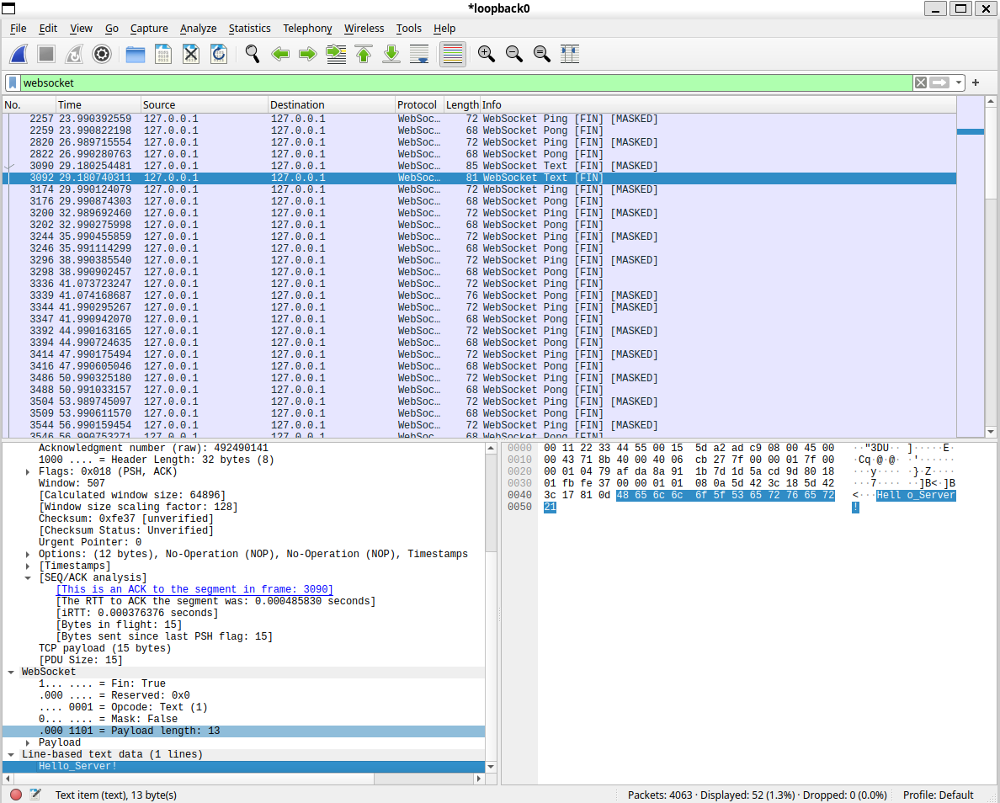

# Lab2 Checkpoint 0

在本 Checkpoint 中, 你将了解到有关网络和 Socket 的基本知识, 并利用它构建一个简单的远程控制软件：远程控制 Server 中的角色上下左右移动.

## 网络与协议

在网络中，来自不同主机，不同进程的各种信息在各种路由器，终端设备中传输、被处理 —— 这一庞大网络的有序运行少不了运行在网络各层的种种协议，这些数量众多的协议组成了 [TCP/IP 协议栈](https://en.wikipedia.org/wiki/Internet_protocol_suite)，它已经渗透进如今网络的方方面面，已然成为当今计算机世界的重要基础设施。这一协议栈以其中最重要的两个协议命名，而我们将要深入使用和了解的便是其中一个协议 —— TCP 协议，并在 TCP 协议的基础上制定我们自己的[应用层](https://en.wikipedia.org/wiki/Application_layer)协议，专门用于 Mini-THUAI 项目的进程间沟通。

协议是计算机网络的基本术语，它包含了不同主体间互相沟通的内容（语义）、格式（语法）、何时该说什么（语序）的规定。例如下面就是一个简单的应用层协议，用于两个进程之间的简单沟通:

- 双方建立 TCP 连接后, 在任何时候, 一方都可以向另一方发送一格式为 `f"Hi, I'm {name}!"`(借用 Python 的 f-string 方便说明) 的字符串, 其中 `name` 是一个仅含 ASCII 字符的字符串, 而对方需要在收到后回复 `f"Hello, {name}"`.
- 若对方不回复, 则... # 协议可以继续约定
- 若某一方接收到了不符合协议第一条所规定的信息, 则... # 协议可以继续约定

例如如下是一个符合该协议的对话:

```
(Connected)
A: Hi, I'm Alice!
B: Hello, Alice!
B: Hi, I'm Bob!
A: Hello, Bob!
(Disconnected)
```

可以看出这个协议不仅规定了说什么，还规定了怎么说，何时说。TCP 协议是网络世界中极其重要的协议，它实现了进程与进程之间的可靠（可靠指发送方发送比特的顺序和接收方接收比特的顺序相同）有连接通信，我们刚才的协议就基于 TCP 协议构建。

Socket, 即套接字，是 TCP/IP 协议栈的抽象 API，有了它我们就不必对背后的协议族有更详细的认知，只需要有下列最基本的认知：
- IP 地址: 动态的逻辑地址，每台设备（更精确地说，每个网卡）在连接上网络的时候都会被分配一个唯一的 IP 地址，路由器（这里的路由器不是我们所说的家用路由器，此为网络中转发消息的节点）可以根据 IP 地址来找到某个特定的设备。我们需要认知一个特殊的 IP 地址: `127.0.0.1`(IPv4) 或 `::1`(IPv6)，它永远表示你的本机，可以用 `localhost` 代替。（注： `localhost` 是域名，例如`www.bilibili.com`也是域名，它们会通过 [DNS服务](https://en.wikipedia.org/wiki/Domain_Name_System) 被解析成 IP 地址）
- 传输层(Transmission Layer)和端口号(Port): 传输层是 TCP/IP 协议栈中负责**进程**间数据传输的一层，最常用的两个协议为 [TCP 协议](https://en.wikipedia.org/wiki/Transmission_Control_Protocol)和 [UDP 协议](https://en.wikipedia.org/wiki/User_Datagram_Protocol)，这两者根据端口号来把送到计算机（或其他网络设备）的所有数据交付给不同的程序。端口号可以用 2 字节表示（也就是说最大的端口号是65535）。某些软件可能占用某些固定的端口号，尤其是较小的端口通常意味着更高的权限，更可能被系统底层应用运用，如 22 端口用于 ssh 连接，80 和 443 端口用于你浏览网页，25565 端口是 Minecraft 用于联机使用的默认端口号（当然这些都可以配置，参加过具身智能挑战赛的想必都调试过 ssh 连接所用端口号）。某一设备的某个端口可以用 `<ip>:<port>` 来表示，如 `localhost:25565` 或 `[::1]:8080`(IPv6地址需要用中括号将IP地址包裹)
- 应用层和 C/S 架构: 应用层是在传输层之上的一层，也是 TCP/IP 协议栈的最顶层，负责应用之间到底应该交换什么信息，我们在上面给出的示例协议就是一个应用层协议，常见的应用层协议包括 HTTP, ICMP(用于email), FTP(文件传输协议) 等; 应用层最常见的架构是 C/S 架构, C 代表 Client, S 代表 Server，其中 Server 是用于提供服务的一端，通常运行在远程服务器上，会被动开放端口等待其他人主动连接；连接上来的主体称为 Client，可以主动连接 Server 开放的端口，二者并不是一个对等关系，而是服务和被服务的关系，Server 和 Client 也并不一定是一对一的关系。
- TCP协议: TCP 是最重要的传输层协议，负责进程之间的有连接可靠通信。TCP 连接由一个[复杂的有限状态机](https://www.ietf.org/rfc/rfc793.txt)(第23页)维护，我们需要了解以下部分：Server 可以监听(listen)本机某一端口，Client 可以连接(connect)某一设备上被监听的端口，这将产生一个 TCP 连接，这一连接支持发送，接收，断开连接等操作。
- WebSocket 协议. 相信聪明的你看到上面的描述已经发现了一些问题: 我们对 TCP 协议的可靠的定义为 "发送和接受的比特顺序" 一致, 并未提到消息的边界! 实际上对于 TCP Socket, 消息确实不存在边界, 你发送的一局 "Hello, World" 在中途未必不会被拆解, 因此信息不存在任何边界信息, 这不利于我们去处理(我们需要花费额外精力去区分消息边界)! WebSocket 协议是基于 TCP 协议的应用层协议, 在 TCP 的基础上额外保证了消息的边界 (还有很多其他功能). 一个 WebSocket Server 的 URL 类似 `ws://host:port`. URL 的格式就是 `<protocol>://host:port/location`, 如 `https://www.bilibili.com/video/av115258752567859/`. 正如 `https` 代表 https 协议一样, `ws` 代表的就是 WebSocket 协议.

很多语言都支持 socket, 也有不少库实现了 WebSocket, 例如 Python 的 `websockets`. 下面是一个 Python Echo-Server 的示例, 它对于任意传来的信息, 都原封不动地发回 Client 一份.

```python
import asyncio
import websockets

async def socket_handler(websocket: websockets.ServerConnection) -> None:
    """Socket handler for our easy protocol"""
    try:
        async for message in websocket:
            print(f"Received from client: {message}")
            await websocket.send(message)
    except websockets.exceptions.ConnectionClosed:
        print("Client disconnected gracefully.")
    except Exception as e: # pylint: disable=broad-exception-caught
        print(f"An error occurred: {e}")

async def main():
    """Start the server"""
    async with websockets.serve(socket_handler, "localhost", 1145) as server:
        await server.serve_forever()

asyncio.run(main())
```

这段代码的 `main` 函数中，我们创建了一个 socket 并通过一个上下文管理器去维护, 这一 socket 会监听 `localhost:1145`. 这里需要稍微区分的是 "socket" 和 "connection" 间的区别, 一个 socket 可以创建多个 connection. 这是符合直觉的, 因为一个服务器也并不会只支持一个用户连接. 每当一个连接进入, `socket_handler` 就会被调用(实际上叫做 `connection_handler` 更为合适), 每当有一个消息进入, 会打印出来调试并且原封不动地发送回去.

有了 Server 就要有配套的 Client. 对于一个 echo server, 我们只要随便写一个能发送任何东西的 client 就可以了. 对于 C++ 的 socket, 过去的 THUAI 常使用 [hvlib](https://github.com/ithewei/libhv) 库, 例如下方是一个读入用户输入的字符串并发送的 client:

```cpp
#include <chrono>
#include <hv/WebSocketClient.h>
#include <memory>
#include <string>
#include <thread>

int main(int argc, char* argv[]) {
    std::string address = "ws://localhost:1145";
    auto ws_client {std::make_unique<hv::WebSocketClient>()}; // create socket

    ws_client->onmessage = [](const std::string& msg) { // define message dealer
        std::cout << "Received message from server:\n    ";
        std::cout << msg << "\n";
    };

    ws_client->open(address.data());
    ws_client->start();
    
    for (int i = 0; i < 5; ++i) { // Send five messages ~~without whitespace~~.
        std::string msg;
        std::cout << "Please input message: ";
        std::cin >> msg;
        ws_client->send(msg);
        std::this_thread::sleep_for(std::chrono::milliseconds(1)); // Wait for reply...
    }
    
    ws_client->close();
    return 0;
}
```

先运行 Server, 再运行 Client, 在 Client 端发布任意信息, 你会发现 Server 已经可以接收到了. 通过 [Wireshark](https://www.wireshark.org/) 捕获所有协议为 `WebSocket` 的报文, 可以看到 Server 也顺利地将信息发回 Client. 

## 关于代码框架

代码框架分为两个部分, 包含 Python 编写的 server 和 C# 语言编写的 client. 代码的大致功能是 Client 接受用户操纵, 向 Server 发送指令, 并且 Server 也要向 Client 提供状态反馈(Optional). 而 Server 有一个被困在围栏中的小人, 你可以操纵小人进行上下左右移动操作, 但移动无法超出围栏. 你的任务为:
- 拟定通信协议, 包含 Client 控制 Server 的语句, 以及可选的 Server 提供状态反馈的协议. 注意小心拟定协议的语序和语义; 对于语法部分, JSON 格式等序列化格式或者二进制格式( 按照字节或比特为单位编码数据) 都是可以的.
- 补全 server 和 C# client 的代码框架.
- (Optional) 使用 C# 和 Python 以外的编程语言, 编写一对新的 client 和 server. 自由组合你编写的 client 和 server, 看看它们是否都能工作.

### Server

在 Server 中, 你只需要更改 server.py. 共有两处需要更改: `Servre._handler` 内的闭包函数 `handler` 和 `Server.serve_forever`. 除此之外的代码框架不多, 也很好理解, 注意观察 `Server` 是如何与其他的模块沟通的, 这对于之后的 Checkpoint 颇有帮助.

### Client

暂未完工:(
